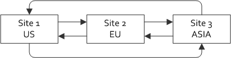

This example sets up several GemFire instances each with 1 locator and 2 servers.   Then it will connect all of the instances together to form a "mesh" network of GemFire Instances.  




# How to run

1. Download and install GemFire and its requirements.
2. Make sure you have `gfsh` in the PATH so the scripts can just run the command `gfsh`.
3. cd into the scripts directory
3. `./startGemFire 5`  This will launch five GemFire distributed systems.   The number of systems can be equal to or greater 2.
4. `./configureMesh 5`  This will configure those five GemFire systems into a mesh network where every distributed system is connnected to every other distributed system.
5. `./putRandomThenGetOnAll 5`  A simple gfh client that looks at the value of a key on each system - does a put on that key with a value of which system did the put and time stamp - then looks at the value on each system for that same key.
6. `./shutdownGemFire 5` - Cleanly shutdown all of the systems.

# Details

Each one of the systems followed this convention if you would like to attach or use any of the distributed systems for a test.

There is one locator for each system.   The ports the locator is running on is:

* JMX Port : `109${systemId}`
* HTTP Services : `707${systemId}`
* Locator : `1033${systemId}`

`${systemId}` is equal to the distributed ID of a given system.   The distributed ID starts at 1 and works up from there.

## Example:

In the following command we are going to connect to the 5th distributed system.   

gfsh>connect --locator=localhost[10335]

That distributed system id is `5` and it is connected to 4 other distributed systems with IDs `1`, `2`, `3` and `4`.

## Sample run:

NOTE:  The scripts are multithreaded - so the output could be out of order.

```
cblack@cblack-z01:/mnt/c/Users/cblack/dev/projects/samples/gemfire-wan-gateway/scripts$ ./startGemFire 5
Launching system 1 with remote locators : localhost[10332],localhost[10333],localhost[10334],localhost[10335]
Launching system 5 with remote locators : localhost[10331],localhost[10332],localhost[10333],localhost[10334]
Launching system 3 with remote locators : localhost[10331],localhost[10332],localhost[10334],localhost[10335]
Launching system 2 with remote locators : localhost[10331],localhost[10333],localhost[10334],localhost[10335]
Launching system 4 with remote locators : localhost[10331],localhost[10332],localhost[10333],localhost[10335]
        Locator in /mnt/c/Users/cblack/dev/projects/samples/gemfire-wan-gateway/data/site4/locator on 172.21.189.192[10334] as locator is currently online.
        Locator in /mnt/c/Users/cblack/dev/projects/samples/gemfire-wan-gateway/data/site2/locator on 172.21.189.192[10332] as locator is currently online.
        Locator in /mnt/c/Users/cblack/dev/projects/samples/gemfire-wan-gateway/data/site5/locator on 172.21.189.192[10335] as locator is currently online.
        Locator in /mnt/c/Users/cblack/dev/projects/samples/gemfire-wan-gateway/data/site1/locator on 172.21.189.192[10331] as locator is currently online.
        Locator in /mnt/c/Users/cblack/dev/projects/samples/gemfire-wan-gateway/data/site3/locator on 172.21.189.192[10333] as locator is currently online.
        Server in /mnt/c/Users/cblack/dev/projects/samples/gemfire-wan-gateway/data/site1/server1 on 172.21.189.192[42233] as server1 is currently online.
        Server in /mnt/c/Users/cblack/dev/projects/samples/gemfire-wan-gateway/data/site5/server1 on 172.21.189.192[46571] as server1 is currently online.
        Server in /mnt/c/Users/cblack/dev/projects/samples/gemfire-wan-gateway/data/site2/server2 on 172.21.189.192[46035] as server2 is currently online.
        Server in /mnt/c/Users/cblack/dev/projects/samples/gemfire-wan-gateway/data/site2/server1 on 172.21.189.192[45753] as server1 is currently online.
        Server in /mnt/c/Users/cblack/dev/projects/samples/gemfire-wan-gateway/data/site4/server1 on 172.21.189.192[35815] as server1 is currently online.
        Server in /mnt/c/Users/cblack/dev/projects/samples/gemfire-wan-gateway/data/site5/server2 on 172.21.189.192[41587] as server2 is currently online.
        Server in /mnt/c/Users/cblack/dev/projects/samples/gemfire-wan-gateway/data/site1/server2 on 172.21.189.192[38377] as server2 is currently online.
        Server in /mnt/c/Users/cblack/dev/projects/samples/gemfire-wan-gateway/data/site3/server1 on 172.21.189.192[35531] as server1 is currently online.
        Server in /mnt/c/Users/cblack/dev/projects/samples/gemfire-wan-gateway/data/site4/server2 on 172.21.189.192[41575] as server2 is currently online.
        Server in /mnt/c/Users/cblack/dev/projects/samples/gemfire-wan-gateway/data/site3/server2 on 172.21.189.192[34403] as server2 is currently online.
cblack@cblack-z01:/mnt/c/Users/cblack/dev/projects/samples/gemfire-wan-gateway/scripts$ ./configureMesh 5
        (2) Executing - create gateway-sender --id='sender1' --parallel=true --remote-distributed-system-id='1'
        (2) Executing - create gateway-sender --id='sender1' --parallel=true --remote-distributed-system-id='1'
        (2) Executing - create gateway-sender --id='sender1' --parallel=true --remote-distributed-system-id='1'
        (2) Executing - create gateway-sender --id='sender1' --parallel=true --remote-distributed-system-id='1'
        (2) Executing - create gateway-sender --id='sender2' --parallel=true --remote-distributed-system-id='2'
        (2) Executing - create gateway-sender --id='sender3' --parallel=true --remote-distributed-system-id='3'
        (2) Executing - create gateway-sender --id='sender3' --parallel=true --remote-distributed-system-id='3'
        (2) Executing - create gateway-sender --id='sender2' --parallel=true --remote-distributed-system-id='2'
        (2) Executing - create gateway-sender --id='sender2' --parallel=true --remote-distributed-system-id='2'
        (2) Executing - create gateway-sender --id='sender2' --parallel=true --remote-distributed-system-id='2'
        (2) Executing - create gateway-sender --id='sender4' --parallel=true --remote-distributed-system-id='4'
        (2) Executing - create gateway-sender --id='sender3' --parallel=true --remote-distributed-system-id='3'
        (2) Executing - create gateway-sender --id='sender4' --parallel=true --remote-distributed-system-id='4'
        (2) Executing - create gateway-sender --id='sender4' --parallel=true --remote-distributed-system-id='4'
        (2) Executing - create gateway-sender --id='sender3' --parallel=true --remote-distributed-system-id='3'
        (2) Executing - create gateway-sender --id='sender5' --parallel=true --remote-distributed-system-id='5'
        (2) Executing - create gateway-sender --id='sender4' --parallel=true --remote-distributed-system-id='4'
        (2) Executing - create gateway-sender --id='sender5' --parallel=true --remote-distributed-system-id='5'
        (2) Executing - create gateway-sender --id='sender5' --parallel=true --remote-distributed-system-id='5'
        (2) Executing - create gateway-sender --id='sender5' --parallel=true --remote-distributed-system-id='5'
        (2) Executing - create gateway-receiver
        (2) Executing - create gateway-receiver
        (2) Executing - create gateway-receiver
        (2) Executing - create gateway-receiver
        (2) Executing - create gateway-receiver
        (2) Executing - create region --name=test --type=PARTITION
        (2) Executing - create region --name=test --type=PARTITION
        (2) Executing - create region --name=test --type=PARTITION
        (2) Executing - create region --name=test --type=PARTITION --gateway-sender-id=sender2,sender3,sender4,sender5
        (2) Executing - create region --name=test --type=PARTITION --gateway-sender-id=sender1,sender2,sender3,sender5
        (2) Executing - alter region --name=test --gateway-sender-id=sender1,sender3,sender4,sender5
        (2) Executing - alter region --name=test --gateway-sender-id=sender1,sender2,sender4,sender5
        (2) Executing - alter region --name=test --gateway-sender-id=sender1,sender2,sender3,sender4
cblack@cblack-z01:/mnt/c/Users/cblack/dev/projects/samples/gemfire-wan-gateway/scripts$ ./putRandomThenGetOnAll 5
===========================================================================
Get all of the values from all of the Systems
===========================================================================
 Looking up key value on distributed system 1
        Key         : myKey
        Value       : null
 Looking up key value on distributed system 2
        Key         : myKey
        Value       : null
 Looking up key value on distributed system 3
        Key         : myKey
        Value       : null
 Looking up key value on distributed system 4
        Key         : myKey
        Value       : null
 Looking up key value on distributed system 5
        Key         : myKey
        Value       : null
===========================================================================
Inserting Fri Mar 17 10:03:30 PDT 2023 on a random distributed system 3
===========================================================================
        (1) Executing - connect --locator=localhost[10333]
        (2) Executing - put --key=myKey --value='Insert from distributed system 3 on Fri Mar 17 10:03:30 PDT 2023' --region=test
===========================================================================
Done - Now sleeping to allow the queue to flush. The default asynchronous
gateway queue setting is 1000 ms or 100 events which ever comes first.
===========================================================================
 Looking up key value on distributed system 1
        Key         : myKey
        Value       : "Insert from distributed system 3 on Fri Mar 17 10:03:30 PDT 2023"
 Looking up key value on distributed system 2
        Key         : myKey
        Value       : "Insert from distributed system 3 on Fri Mar 17 10:03:30 PDT 2023"
 Looking up key value on distributed system 3
        Key         : myKey
        Value       : "Insert from distributed system 3 on Fri Mar 17 10:03:30 PDT 2023"
 Looking up key value on distributed system 4
        Key         : myKey
        Value       : "Insert from distributed system 3 on Fri Mar 17 10:03:30 PDT 2023"
 Looking up key value on distributed system 5
        Key         : myKey
        Value       : "Insert from distributed system 3 on Fri Mar 17 10:03:30 PDT 2023"
cblack@cblack-z01:/mnt/c/Users/cblack/dev/projects/samples/gemfire-wan-gateway/scripts$

```

# Directory
```
.
├── LICENSE.txt - Apache License
├── data - This is where all of the data and logs go.
├── images - Images for the readme.md
├── readme.md - this document
└── scripts
    ├── configureMesh - Create the wan gateway to each member and configure a region for the data to live.
    ├── putRandomThenGetOnAll - A sample to drive the demo.
    ├── shutdownGemFire - Shutdown all of the members in all of the distributed systems.
    └── startGemFire - Start up all of the distributed systems in the demo.
```
